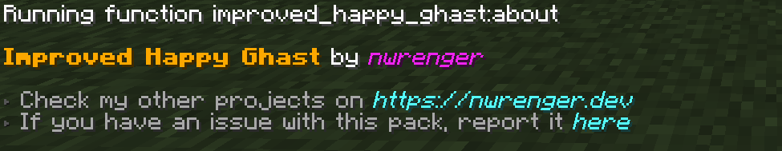
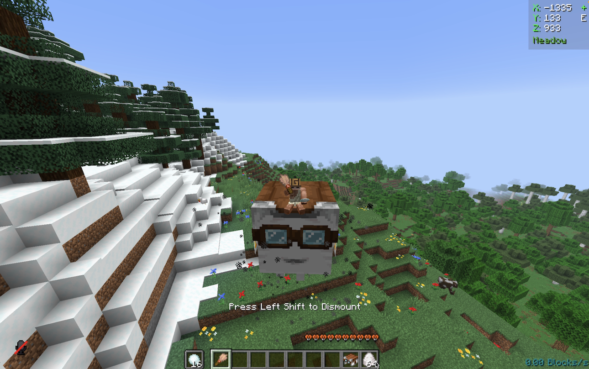
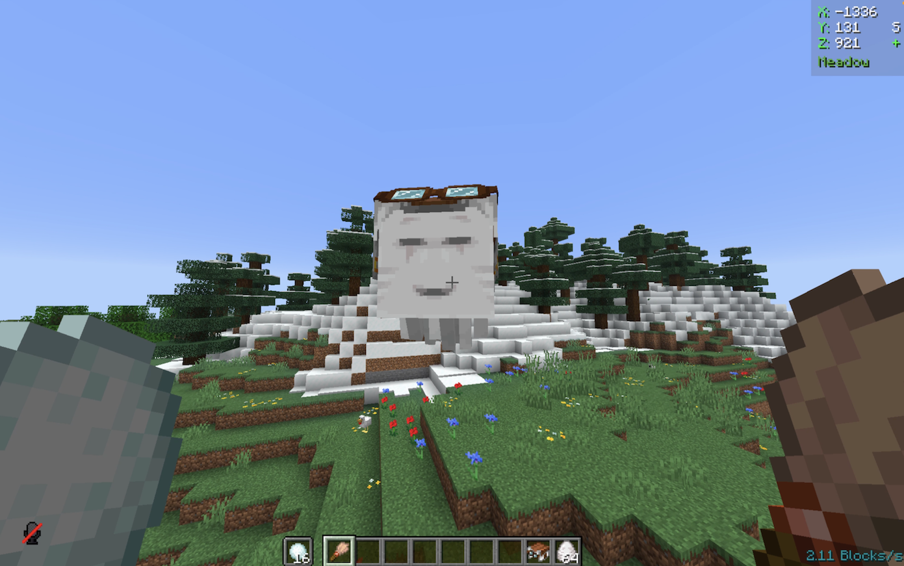
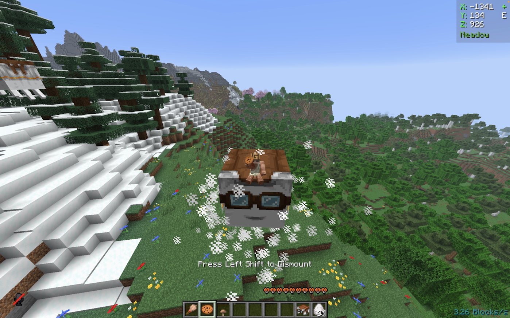
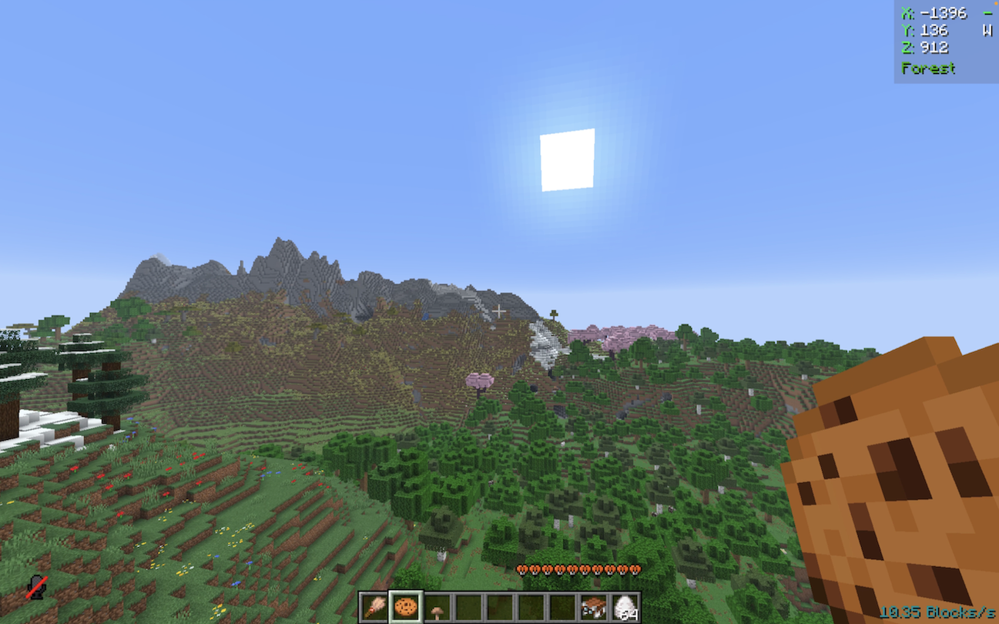
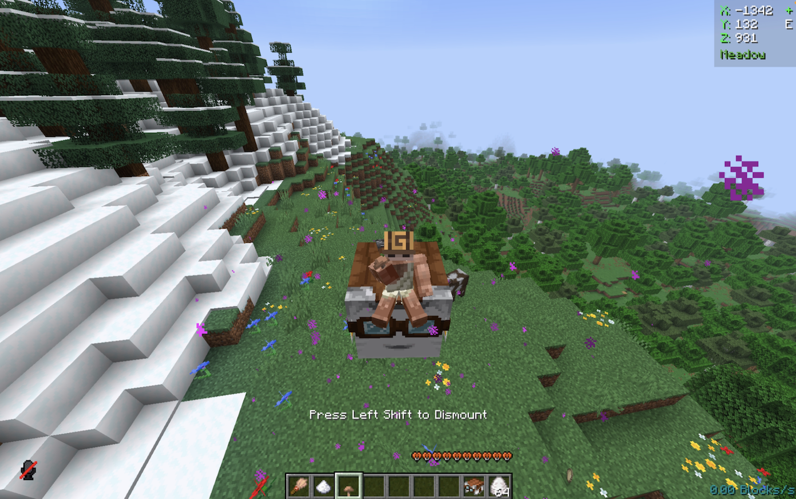
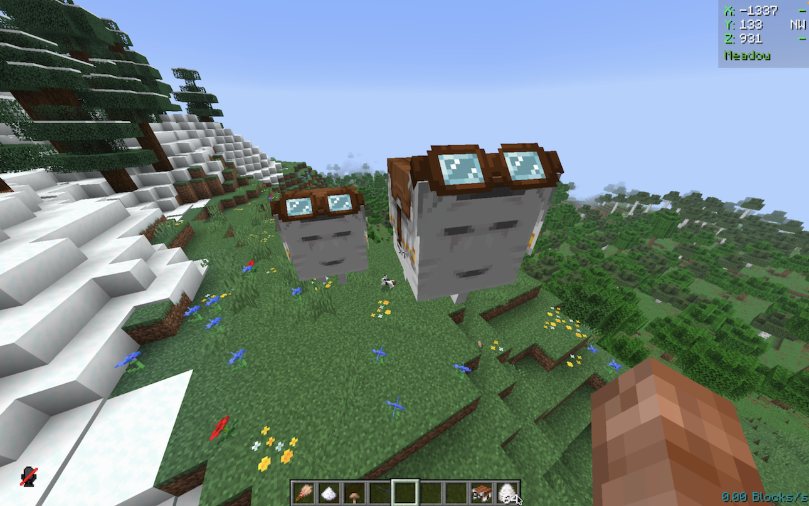
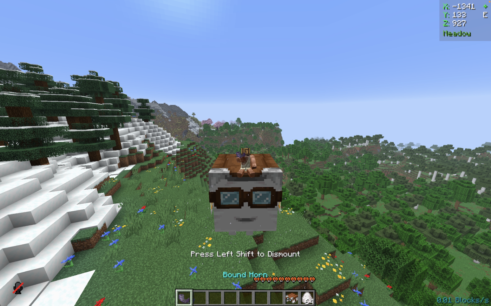
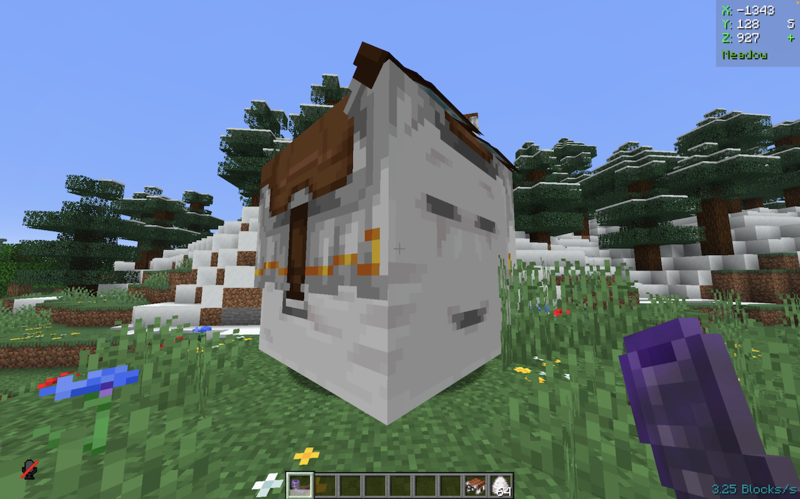

# Improved Happy Ghast

[](https://modrinth.com/datapack/improved-happy-ghast)
[](https://modrinth.com/datapack/improved-happy-ghast)
[](https://modrinth.com/datapack/improved-happy-ghast)

Allows players to create a **not-wandering**, **faster**, **smaller** Happy Ghast and even **summon** it back in survival using items.

> Makes the Happy Ghast usable again while staying balanced and survival-friendly.

## Installation

After adding the data pack/mod to your world or server, you should be able to open the about panel, which is fully controllable with the mouse:

```mcfunction
/function improved_happy_ghast:about
```



## Usage

The above-mentioned improvements can be done by **right-clicking** the Happy Ghast with **certain items** in the **mainhand** of the player. As a confirmation, the player will see particles and a subtle sound cue. To **revert** these changes, just repeat the mentioned steps again.

### Disable Wandering

**Item**: Brush

> **Right-clicking and applying**
>
> 

> **Not following snowballs and not-wandering**
>
> 

## Increasing Speed

**Item**: Cookie

> **Right-clicking and applying**
>
> 

> **Faster, measured in-game speed at ~10b/s**
>
> 

## Reducing Size

**Item**: Brown Mushroom

> **Right-clicking and applying**
>
> 

> **Compared to a normal one on the right**
>
> 

## Summoning Back

**Item**: Goat Horn (bound)

> **Right-clicking and applying**
>
> 

> **Summoned to your side, even across dimensions**
>
> 

## Contributing & Issues

I warmly welcome:

- Bug reports
- Feature requests
- Pull requests

Please open issues or PRs on [GitHub](https://github.com/nwrenger/improved-happy-ghast/issues).

## License

This project is licensed under the **MIT License**. See [LICENSE](https://github.com/nwrenger/improved-happy-ghast/blob/main/LICENSE) for details.
