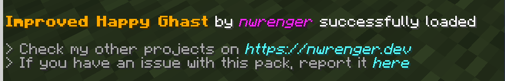
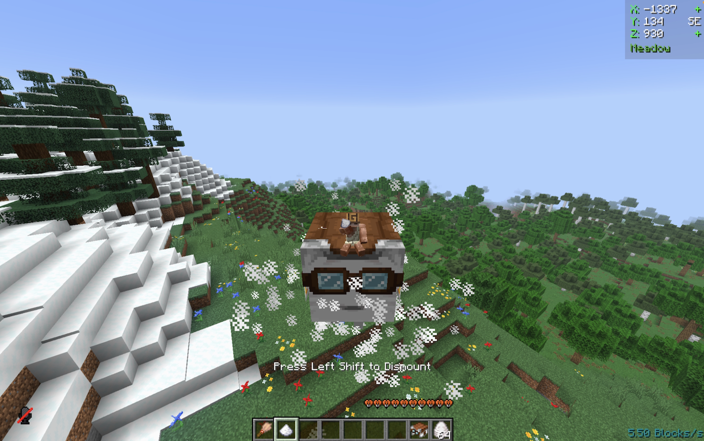

# Improved Happy Ghast

Allows players to create a **not-wandering**, **faster**, **smaller** Happy Ghast in survival using items.

> Makes the Happy Ghast usable again while staying balanced and survival-friendly.

## Installation

After adding the data pack/mod to your world or server, you should see this confirmation message on login when the world loads:

## Usage

The above mentioned improvements can be done by right-clicking the Happy Ghast with certain items in the mainhand of the player. As a confirmation the player will see particles and a subtle sound cue. To revert these changes just repeat the mentioned steps again.

### Disable Wandering

**Item**: Brush

> **Right-clicking and applying**
>
> 

> **Not following snow balls and not-wandering**
>
> 

## Increasing Speed

**Item**: Sugar

> **Right-clicking and applying**
>
> 

> **Faster, measured in-game speed at ~10b/s**
>
> 

## Reducing Size

**Item**: Brown Mushroom

> **Right-clicking and applying**
>
> 

> **Compared to a normal one on the right**
>
> 

## Contributing & Issues

I warmly welcome:

- Bug reports
- Feature requests
- Pull requests

Please open issues or PRs on [GitHub](https://github.com/nwrenger/improved-happy-ghast/issues).

## License

This project is licensed under the **MIT License**. See [LICENSE](https://github.com/nwrenger/improved-happy-ghast/blob/main/LICENSE) for details.
